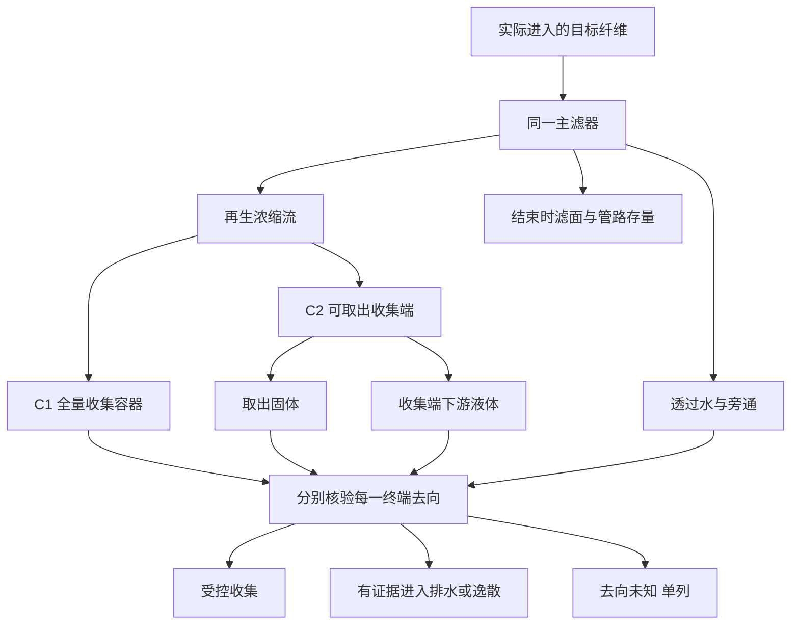

# H1流路与终点示意

以下是待验证方案的计量图，没有实验结果。

C1与C2是不同试验条件，不是在同一次试验中重复计算同一浓缩流。上游浓缩样仅用于过程核对；如果其最终固体和液体已经进入衡算，不再加一次浓缩总量。

质量账：实际输入＝互斥终端移出＋期末存量－期初存量＋未解释差额。

排水/逸散账与质量账分开：受控留存、液转固和最终环境减排是三件不同的事。期末存量的破坏性分析回收也不属于运行期装置固体移出成绩。
