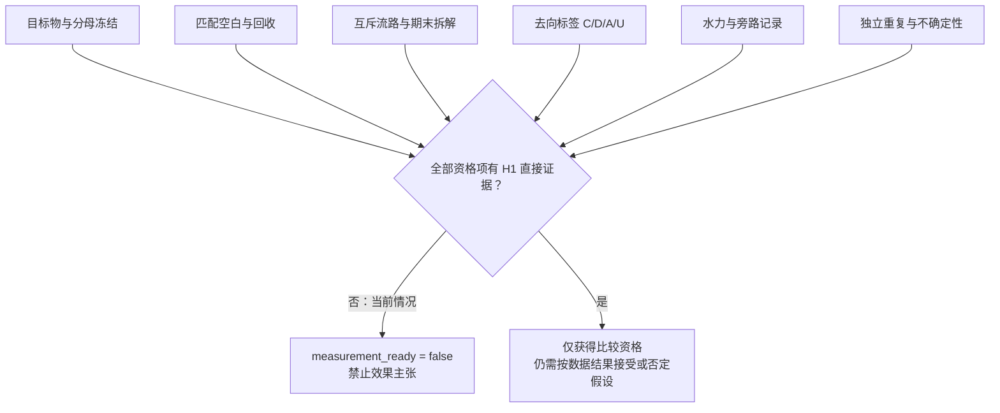

# H1 判定资格证据审计

更新：2026-09-21。性质：研究阶段的资格审计，逐项区分“来源已说明”“H1 尚未具备”和“不能从来源推得”。它不是实验记录、实验方案执行单或论文正文；不产生任何 H1 效果结论。

## 审计问题

在比较 C1（再生浓缩流进入开放受控容器）与 C2（同一浓缩流进入可拆收集端）之前，H1 是否已经拥有足以判定物料流向、失控流路和水力恢复的证据？

判定规则只有一条：若关键量的对象定义、取得过程、流路边界和不确定性没有同时闭合，则 `measurement_ready=false`，后续可以继续研究或预试验，但不得形成“C2 更好/更差/无影响”的效果主张。

## 逐项审计

|资格项|本地来源已经说明的事实|H1 当前证据|不能据此推得的内容|本项放行条件|
|---|---|---|---|---|
|目标物与分母|L01、L03、L07、L09 等研究的计数、干质量、湿棉絮、材质和尺寸范围并不等价；L07 的三流质量分母是已回收总量而非初始投加量。|没有 H1 的目标材料、尺寸范围、质量或计数分母的冻结记录。|不能把网孔、收集膜孔径或天平读数写成检出/定量能力。|每个主要指标的对象、材料、尺寸、单位、分母和纳入/排除规则均固定。|
|空白链|L01、L03、L07 都报告了不同形式的程序空白或清水控制；其设计和校正规则不相同。|没有与 H1 试样、容器、过滤介质、清理过程和分析流程相匹配的空白证据。|不能把文献空白水平搬作 H1 的空白校正或“背景为零”。|空白类型、频率、处理方式和异常记录在 H1 条件下实际核验。|
|回收与分样代表性|L07 对浓缩液、透过液和滤芯残留分流计量，但透过液为部分取样外推；其公开汇总回收率也不能作为 H1 的校正系数。|没有针对 H1 的材料、浓度、来水和流路的端到端回收或分样代表性证据。|不能用标准纤维的某次回收率代表真实洗衣废水，亦不能用单一分样代表全量。|在 H1 匹配条件下验证分样、外推和回收适用范围；失败时保留原始量并将校正估计降级。|
|互斥流路|L07 的浓缩液、透过液、滤芯残留说明至少需要多流路记账；F21 的进出水比较不能代替固相、清洗废液和残留的闭合。|尚无 H1 的真实管路图、旁路/溢流位置、拆卸滴漏、冲洗废液和期末拆解的逐项记录。|不能将滤器内“看不见的残留”静默归入已捕获或已移出。|`M_pass`、`M_solid`、`M_waste`、`ΔM_inventory` 和 `ε` 的获取位置明确，且每个条目只进入一条流路。|
|最终去向|公开技术文本说明可拆容器、二次流和维护接口可以存在，但没有提供 H1 的滴漏、旁路、最终处置或环境去向数据。|尚无 H1 的 C/D/A/U 标签证据。|不能把受控留存 C 或未知 U 当作零排放；也不能把收集端存在当作最终处置已完成。|每条物料流均附 C（受控留存）、D（有证据排水）、A（意外逸散）或 U（未知）及对应取证方式。|
|水力与旁路|F22 指出压降、堵塞、维护和旁路会共同影响外置滤器表现；F21 的连续使用与 L07 的清理触发均不能直接给出 H1 的恢复结果。|没有 H1 的共同测试点压差/流量、清理前后状态、首次再运行释放或旁路/溢流记录。|不能以“能继续流动”替代水力恢复，也不能将疑似生物膜写成已证实根因。|固定水力测点和运行状态，记录清理前后与首次再运行，并对旁路/溢流给出可审计记录。|
|重复与不确定性|L01、L03、L07 的独立重复数和误差处理各异，显示重复设计必须与研究边界一致。|没有 H1 的独立重复定义、异常处理、区间方法或预定实用差异规则。|不能从单轮最好值推出 C1/C2 的稳定差异，也不能以文献样本量替代 H1 重复。|独立重复的单位、失效样本处理和不确定性呈现规则在实施前冻结。|

## 当前资格结论



截至本次审计，H1 的全部关键项都是“来源说明了为何必须做”，但尚未有“H1 直接证据”。因此结果为：

```text
measurement_ready = false
effect_claim_allowed = false
research_stage_allowed = true
```

这不是项目失败，也不是要把已有文献重新下载。它只把下一步的研究任务限定为：先构建能让上述资格项被逐项证伪或放行的最小证据链，再讨论 C1/C2 的条件差异。

## 不能跨越的推理边界

1. 文献中的某个回收率、空白量、网孔或循环次数只能说明该来源在其边界内做过什么；不能变成 H1 数值、H1 阈值或 H1 性能。
2. 专利和公开技术文本说明技术路线公开存在；它们不是效果、寿命、滴漏、环保收益或法律结论的实测证据。
3. 计数、干质量、湿棉絮、材质比例、网孔和滤膜孔径必须分列；任何两项的替换都需要针对 H1 的额外验证。
4. 即使物料衡算的差额接近零，也必须同时报告未知去向和期末存量；“闭合”不等于“没有未测损失”。

## 与现有文件的衔接

- 《[H1 计量方法与证据缺口](H1_计量方法与证据缺口.md)》提供各来源的可比边界。
- 《[H1 研究命题收敛与证据审计](H1_研究命题收敛与证据审计.md)》限定 C1/C2 的可证伪研究问题。
- 《[H1 效果主张预注册骨架](../experiment_planning/H1_效果主张预注册骨架.md)》规定一旦资格放行后，哪些表达可以或不能出现。

本文件的唯一结论是当前不能判定效果；它不会预设 C2 必然优于 C1，也允许后续证据表明差异不存在、C2 更差，或关键流路仍无法判定。
