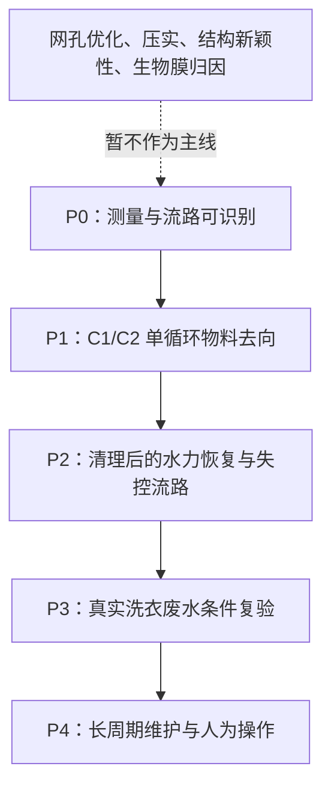

# H1 研究优先级裁定

更新：2026-09-22。性质：依据已核原文和公开技术文本，为 H1 排定“先研究什么、什么暂不研究”的证据顺序。它不是实验执行记录，不含实验参数、样本量、阈值或结果。

## 裁定原则

优先级不按“看起来新”“结构更复杂”或“文献百分比更高”排序，而按一个问题是否会使后续所有效果解释失效排序。若上一级不能被证据支持，后一级不得升级为 H1 结论。

## P0：先研究测量与流路是否可识别

**原因。** L07 虽能分列浓缩液、透过液和滤芯残留，但其已回收三流分母并非初始投加量；F19 的异日样瓶不能形成因果对照；F21 的进出水浓度又不能涵盖滤器固相、清洗废液和设备存量。因此，只要对象、空白、回收、分样与互斥流路不清楚，任何“C2 更好”的判断都会失去可解释性。

**本级只回答。** C0 下各质量条目能否互斥记账，未知差额和期末存量能否被单独保留，而非被改写为捕集。

**终止/降级信号。** 关键流路长期为 U，或回收/分样不适用于目标对象时，不进入 C1/C2 效果比较；仅保留方法问题，不保留装置效果问题。

## P1：再研究 C1/C2 是否改变物料去向

**原因。** 多件公开技术文本已经存在“再生、二次流、可拆容器、下游回收”的路径，L07 也表明浓缩并不等于最终处置。因此，H1 的有效问题不是有没有收集端，而是 C1 与 C2 是否让更多目标物作为可记录的已取出固体离开本次边界，以及是否改变 D/A/U。

**本级只回答。** 在相同滤器、来水、运行终点和清理触发下，`M_solid`、`M_waste`、`M_pass`、`ΔM_inventory` 与 `ε` 的完整分配是否随 C1/C2 改变。

**终止/降级信号。** 若 C2 只是把同样受控的液体重新命名为固体，或两组的未知流路无法区分，则不主张环境收益；最多保留含水率、储运接口或操作负担的描述性问题。

## P2：再研究清理后水力恢复和失控流路

**原因。** L05 的棉絮层与堵塞、L07 的清理后残留、F22 的压降/旁路/维护耦合都说明，单一排水端下降不能回答设备能否稳定运行。F21 的 50 次未清洗也不能替代清理后恢复。

**本级只回答。** 共同测试点下的压差或流量恢复、首次再运行释放、旁路/溢流和拆卸滴漏是否随 C1/C2 改变。

**终止/降级信号。** 若“恢复”只能通过改变泵工况取得，或 C2 更早旁路、溢流、滴漏，则淘汰“收集端改善可用性/减少失控流路”的说法。

## P3：最后才研究真实洗衣废水的适用性

**原因。** L07 的标准 2 mm 聚酰胺纤维不能代表混合衣物、洗涤剂、毛发和颗粒共存；F08、F21 提示真实废水下质量、材质和分样仍需分列。真实洗衣废水不是把标准纤维结论直接放大，而是独立复验边界。

**本级只回答。** P0—P2 的可解释流路在记录到的真实材料、洗涤程序和基质下是否仍成立。

**终止/降级信号。** 缺少与该基质匹配的材质鉴别、空白或回收证据时，不外推到家庭真实使用，也不讨论“真实环境减排”。

## 暂不进入主线的问题

|问题|为什么暂不作为主线|何时才可能进入|
|---|---|---|
|网孔或孔径“最优值”|L09、L12 显示材料、方法与孔径耦合；更细不等于可用，也会混入过滤本体差异。|P0—P2 通过后，以独立变量研究。|
|压实/脱水|公开技术文本已有路径，且可能把液相损失转移到未计量废液。|先证明 C2 的流路和恢复可解释，再单独比较有/无受控脱水。|
|“结构新颖性”|公开技术文本可用于技术路径对照，不提供法律结论。|如需法律问题，另行做权利要求与专业检索，不能用本研究替代。|
|生物膜机制|F22 表明对外置滤器的定量因果证据不足。|只有进入真实废水长周期并取得直接测量时。|
|用户依从性|L02/L14 的参与过程包含研究性动作，不能等同家庭长期行为。|形成稳定、可重复的技术维护流程后，另行行为研究。|

## 当前裁定

H1 当前处于 **P0：测量与流路可识别** 的研究阶段，尚未获得 P1 的比较资格。这个裁定不预期 C2 会成功；它允许最早在 P0 发现“无法解释”的结果，并据此停止把 C2 当作优先路线。

关联材料：

- 《[H1 判定资格证据审计](H1_判定资格证据审计.md)》逐项给出当前为何 `measurement_ready=false`。
- 《[H1 候选技术差异与淘汰条件](H1_候选技术差异与淘汰条件.md)》给出 C0—C2 的比较边界和各候选淘汰条件。
- 《[H1 主张证据账本](H1_主张证据账本.md)》绑定每项来源事实与推论禁区。
