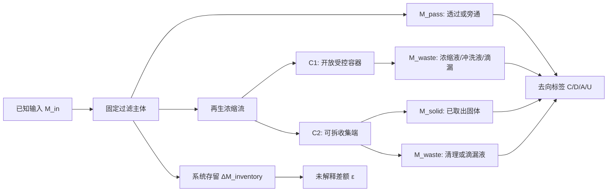

# H1 研究命题收敛与证据审计

更新：2026-09-21。性质：基于本地已核原文、综述和公开技术文本形成的研究论证；不是论文正文、不是实验记录、不是产品或专利结论。这里的“假设”都尚未经过 H1 实验检验。

## 1. 先回答：H1 现在究竟研究什么

H1 不再研究“能否增加一个滤器、一个可拆盒子或一个再生动作”。这些结构路线已分别在公开技术文本中出现：可拆滤芯及维护接口、封闭可移出容器、清理后的下游回收、二次流转移到收集腔，以及筒内滤面转移到独立腔室。因此，结构存在本身既不能构成 H1 的研究发现，也不能说明环境收益或长期可用性。

H1 收敛为一个更窄、也能被证伪的问题：

> **在相同过滤主体、相同来水、相同运行终点和相同清理触发条件下，将再生浓缩流从开放受控容器 C1 接入可拆收集端 C2，是否会改变目标纤维的可验证流向，并在不新增失控排水/逸散的前提下维持可重复的水力恢复？**

这里的因变量不是单一“过滤效率”。它至少包括四类互不替代的结果：已取出固体、已证实排水或逸散、系统内残留、以及再生后水力表现。

## 2. 证据把研究问题推到这里的原因

|已核来源|它已经支持的事实|它不能替 H1 回答的部分|对研究问题的作用|
|---|---|---|---|
|L07 Hamann et al. 2025|同一系统可把纤维分到浓缩液、透过液和滤芯残留；清理后仍会留下残留，浓缩液的最终减量和处置仍是问题。|其标准纤维、重力供水和既定清理触发不能代表真实洗衣排水；三流已回收量不能代替投入质量闭合。|证明“截留”与“可控移出”是两件事，要求将再生流与残留独立记账。|
|F19 Rachman et al. 2025|三段过滤和样瓶显微观察可以形成一个局部处理比较。|不同日期、不同废水样瓶的比较无法归因于滤器；没有材质确认、全量排水或末端流路。|给出反例：H1 不能以不同批次局部样瓶的百分比作为效果证据。|
|F21 Park et al. 2025|排水端多级过滤、进出水比较、连续使用和 µFTIR 判据均可实施。|进出水浓度不能显示被截留物最终在哪里；缺少滤器固相、清洗废液、存量与移出物的完整闭合。|把“连续循环”从宣传性的次数改成需要完整流路记录的观察框架。|
|F22 Song et al. 2026|压降、堵塞、旁路和维护会共同影响外置滤器表现；最终移出与处置仍需处理。|综述中的异质产品数据不能组成 H1 指标；外置滤器生物膜影响多为推断而非直接定量结果。|要求水力和流向并列记录，同时禁止把推断性的生物膜问题写成已证实根因。|
|五件公开技术文本|可拆容器、二次流、下游回收、维护接口和脉冲转移均已有技术路径。|不提供 H1 的回收率、滴漏、旁路、寿命或最终处置实测。|排除“增加收集端”作为研究结论，保留“加入收集端后流向是否改变”作为可测问题。|

## 3. H1 的因果链与最小可识别条件

要把 C1 与 C2 的差异归因于“收集端”，下列条件缺一不可：

1. 过滤主体、来水、运行终点、清理触发和取样规则固定；C1/C2 之外不得同时改孔径、泵工况、清理强度或取样体积。
2. 每个质量条目只在一条流路出现一次：`M_in = M_pass + M_solid + M_waste + ΔM_inventory + ε`。没有闭合不等于“全部被捕集”。
3. `C`、`D`、`A`、`U` 是去向标签而非质量类别。只有已经有证据的 `D+A` 能组成试验边界内的 `M_discharge`；`C` 与 `U` 均不能被置零。
4. 水力记录至少同时保留同一测试点的压差或流量、旁路/溢流状态、清理前后状态和首次再运行时的释放。任何未计量旁路都会破坏进出水浓度解释。
5. 质量、可见纤维计数、材质鉴别和尺寸范围分列报告。收集膜孔径、网孔和显微分辨率不是同一个检出能力，也不能互相代替。

## 4. 可被否定的研究假设

|编号|研究假设|只有在何种证据下才可以暂时支持|会直接否定或降级它的结果|
|---|---|---|---|
|H1-A：转移假设|C2 使更多目标物以已取出的、可记录的固体离开本次系统边界。|在同一材料/尺寸定义和完整物料衡算下，`M_solid/M_in` 的差异伴随可解释的 `ΔM_inventory` 与 `ε`。|差异只来自液体被重新命名为固体；或 C1/C2 的期末残留、未知去向或差额无法解释。|
|H1-B：失控流路假设|C2 不增加、并可能降低有证据的 `D+A`。|每一条透过、旁通、滴漏、清洗和紧急排液都有去向与量，且 C2 的 `M_discharge/M_in` 不恶化。|收集端拆卸、溢流或清洗使 `D+A` 增加；或关键流路是 `U`。|
|H1-C：水力恢复假设|C2 不降低、并可能改善再生后恢复。|在共同压差或共同流量测试点，清理后的恢复、首次再运行释放和旁路状态同步改善或至少不恶化。|只能通过改变泵工况显示恢复；压差升高、流量下降、旁路提前或残留递增。|
|H1-D：操作价值假设|如果 D+A 没有变化，C2 仍可能只在含水率、储运接口或规范化操作负担上有价值。|同一受控边界内，固体含水率、取出动作、清理用水、滴漏和操作时间均被真实记录。|把“受控浓缩液”改记为“固体”后直接宣称环境收益；或减少一个操作却增加不可控滴漏。|

这些是假设，不是预期结果。H1 允许出现“C2 没有增益”“C2 更早旁路”“差异无法判定”三类同等有效的研究结论。

## 5. 当前最关键的研究缺口

### 5.1 不是“缺一个更细的滤网”

公开文献已反复显示孔径、材料和运行条件会改变排水端观测，但不同研究的分母不同：有的是湿棉絮、有的是下游干质量、有的是局部计数、有的是已回收三流质量。没有一个共同数字可直接用于设定 H1 的“目标去除率”。因此 H1 不以追逐单一百分比开始。

### 5.2 是“再生后去哪里、是否真的离开、代价是什么”

L07 的浓缩液、F21 的进出水对比、F22 的维护/旁路问题共同指出：若没有过滤固相、再生/冲洗废液、装置存留和实际移出物，任何一次高排水端下降都不能说明目标物被妥善移出。H1 的研究价值位于这条缺失的因果链，而不是重复一份前后浓度图。

### 5.3 长周期必须先拆开两个问题

第一是物理残留、堵塞和旁路；第二是可能的生物膜相关阻力。F22 明确后者在外置洗衣机滤器上仍缺直接定量研究。H1 若未来进入真实洗衣废水长周期，只能把第二项写成待验证分支，不能用它解释任何当前压差变化。

## 6. 研究推进顺序

1. **先做证据资格审计。** 不运行 C1/C2 比较；先确认测量对象、空白、适用回收、分样代表性、流路图、材质证据和不确定度口径均可记录。当前 `measurement_ready=false`。
2. **再判断单循环是否可识别。** 如果 C1/C2 的每条流路无法互斥计量，就停止讨论“收集端效果”，返回修正测量边界。
3. **只有单循环闭合后才研究恢复。** 固定清理触发和停止规则，不从表现最佳的循环挑结论；压差/流量与旁路、残留和清洗液必须同轮记录。
4. **真实洗衣废水放在最后。** 标准纤维只能验证计量链，不跨越到真实衣物、洗涤剂、毛发和颗粒共存的长期结论；真实样本需要单列材质鉴别、空白和匹配回收。

## 7. 当前研究判断

现有资料已经足以把 H1 从“设计一个滤器”收敛为“验证一个收集端是否带来可识别的物料去向与维护收益”。但现有资料不足以预言 C2 必然优于 C1，也不足以声称任何减少环境排放、延长寿命、无生物膜风险或家庭可用性。研究下一步的第一成果应是**判定资格**，而不是提前给出滤效数字。

## 来源定位

- L07：`L07_Hamann2025_精读卡.md`，主文第 3—11 页、图 5/6、补充材料和原始表复算边界。
- F19：`../acquisition_followup/F19_Rachman2025_研究卡.md`，原文第 3 页的分组与局部样瓶方法。
- F21：`../acquisition_followup/F21_Park2025_研究卡.md`，原文第 3—8 页的排水端结构、连续使用和 µFTIR 方法。
- F22：`../acquisition_followup/F22_Song2026_研究卡.md`，综述关于压降、旁路、维护、去向和外置滤器生物膜推断的边界。
- 技术文本：`../../patents/expansion_20260921/20260921_公开候选专利续接筛选.md`，五件公开技术路径；不作法律结论。
- 计量细节：`H1_计量方法与证据缺口.md`、`H1_效果主张预注册骨架.md`、`H1_候选技术差异与淘汰条件.md`。
