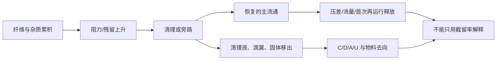

# H1 维护、旁路与清理废流证据合成

更新：2026-09-22。性质：对已提取全文中的维护、水力、旁路与清理废流证据进行交叉研究。它不提供 H1 的压差、寿命、清理周期或收集端性能。

## 可直接从来源读取的事实

|来源|本地定位|来源实际说明的事实|对 H1 的约束|
|---|---|---|---|
|L05 Belzagui 2023|全文约第 211、250、295、521 行；精读核验卡|固定负荷下两种过滤布置运行至堵塞，文中报告约 30/40 次洗涤前堵塞差异，并引用最低清理间隔的既有信息。|“截留随积累提高”不能单独作为优点；堵塞与清理间隔必须同时进入评价，且该结果不能移作 C1/C2 周期。|
|L07 Hamann 2025|全文约第 11—15、197 行；主文 pp.6、8、10—12|装置用周期性阀切换把部分纤维送到外部容器；清理后仍有残留，压差触发是后续设想而非已验证闭环。|C1/C2 不能仅继承“自清理”标签，必须记录残留、清理触发、首次再运行和水力状态。|
|L02 Erdle 2021|全文约第 186—195 行；原文 p.3|所用外接滤器存在满载时的旁通，以防溢水；作者未收到旁通报告。|“未报告旁通”不等于旁通量为零；H1 要记录每次旁通、泄漏、溢流和其去向。|
|L13 Gao 2026|全文约第 835—876 行；原文 p.38|慢砂过滤的清理与维护废水管理会影响总体纤维去向；清洗可导致累积纤维释放。|清理废流不是“装置外的杂项”，而是物料衡算和 C/D/A/U 标签的一条独立支路。低通量慢砂条件不外推为即时排水。|
|F22 Song 2026|全文约第 81、355—367、378 行；研究卡|综述将压降、堵塞、耐久性、维护和饱和旁路并列；更细介质可提高表观捕集同时增加阻力和维护频率。|网孔、滤效与可用性不能单独排序；H1 需要共同记录流量/压差、旁路及维护动作。综述不提供 H1 的性能数值。|

## 合成后的因果链

这个链条说明，H1 不能把“维护”缩写成一个清理次数：同一个清理动作既可能恢复流通，也可能把目标物带入清理液、滴漏或旁路。C1/C2 的真正差异若存在，应同时出现在 **水力恢复** 与 **清理后物流去向** 中；只要其中一半缺失，就不能称为净收益。

## 对 C1/C2 的可证伪问题

1. C2 是否使清理后的可取出固体增加，同时没有增加可证实的 D/A？若只是同一受控浓缩液改记为固体，结论只能是形态或操作差异。
2. C2 是否在共同的运行状态下恢复同等或更好的流量/压差，并且首次再运行没有新增未计量释放？若要靠改变泵工况或让旁路提前发生，不能叫恢复。
3. C2 的拆卸、排空和冲洗是否形成额外 `M_waste`、滴漏或未知去向？`M_waste` 本身不是排放，必须附 C/D/A/U。

## 当前不能作出的判断

- 不能从 L05 的堵塞次数或 F22 的综述表格给 H1 指定清理周期、压差上限、孔径或寿命。
- 不能从 L02 的“未收到报告”说 H1 旁路风险为零。
- 不能从 L07 的周期清理说 H1 已有闭环压差控制或可恢复到全新状态。
- 不能从 L13 的慢砂维护废流推得 C1/C2 的实际清理损失。

因此，该研究分支只把 H1 的 P2 研究对象明确为：**维护动作后的主流恢复和全部副流去向必须同步证实。** 它不把任一来源的数值转换为 H1 的预期结果或设计阈值。

关联材料：

- 《[H1 候选技术差异与淘汰条件](H1_候选技术差异与淘汰条件.md)》的第 3、5、7 项给出 C1/C2 的淘汰边界。
- 《[H1 研究优先级裁定](H1_研究优先级裁定.md)》说明本分支须在 P0 后才可进入主比较。
- 《[H1 主张证据账本](H1_主张证据账本.md)》保留每条来源事实的推论禁区。
